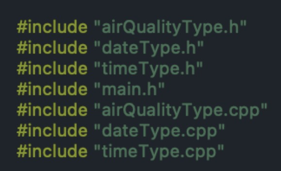

# Air Quality Answer

Language: C++

## Aim of the project

This project could be used to extract data from the given file, calculate and give answers to the user's chosen problem.

## User guide

If the user uses Vscode to run this program, the user should include both .h and .cpp files.

If the user uses Clion to run this program, the user should only include .h files.

When the program is executed, the user should first enter the file path of the database in the format of txt. Then the program will present the overview of the given file and following options, such as the current number of entries in the database. The user could choose from the menu options repeatedly until the user decides to quit.

1. enter month and the program should display the average temperature for that month.
2. enter month and the program should display the average relative humidity for that month.
3. enter month and the program should display the average absolute humidity temperature for that month.
4. enter a valid date and time. The program should then display the temperature, and relative humidity at that date and time.
5. enter the month and the program should display the highest temperature for that month.
6. enter the month and the program should display the highest relative humidity value for that month.
7. enter the month and the program should display the highest absolute humidity for that month.
8. enter the month and the program should display the dates and times for a month when the temperature is higher than the average temperature for that month along with values of the temperature.
9. enter the month and the program should display the dates and times for a month when the relative humidity is higher than the average relative humidity for that month along with values of the relative humidity.
10. enter the month and the program should display the dates and times for a month when the absolute humidity is higher than the average absolute humidity for that month along with values of the absolute humidity.

## Description of the project along with its purpose

The project uses c++ language to read data from the given txt file, extract the data and store the data in the STL vector. The libraries of C++ Standard Library used in this project are iostream, string, vector, iterator, iomanip. The classes used in this project are dateType, timeType, airQualityType's header files and their corresponding cpp files.
When the project is executed, it will first prompt the user to enter the path of the file that should be processed. If the file cannot be found at given file path the terminal would print "Invalid file. Please check file name:" and prompt the user to enter file path until the user enter valid file path. If the file can be found but it is an empty file, the program will print "The file is empty" in the terminal and prompt the user to enter non-empty file path until the user enter valid file path. If the file can be found and it is not empty, the terminal would present corresponding overview of the given file, such as the units of measurement of the given attributes, current number of entries in the database, and so on.
Then the user could choose from the ten options in the menu.
The ten options are in three categories:

1. calculating average and highest value in a specific month about Temperature, Relative Humidity, and Absolute Humidity
2. filtering data about Temperature in a specific month about Temperature, Relative Humidity, and Absolute Humidity
3. find the air quality value in a specific date.
   For the first and second kinds of options, the project will repeatedly prompt the user to enter valid month and year in the range of database until the user enters valid inputs. For the last purpose, the project would prompt the user to enter date and time and check if the date and time could be found in the database. If could, the terminal would print the corresponding air quality value.
   The program will run all the time until the user enter "q" to quit.
   The project's purpose: extract data from the given file, calculate and give answers to the user's chosen problem.

## Class diagram

## Test plan and testing results

(by using testing.txt)
see test_plan.pdf

## Assumptions

1 The file input by the user should be .txt.
2 The file content should be organized as intended: date in column 0, time in column 1, temperature in column 16, relative humidity in column 17, absolute humidity in column 18.
